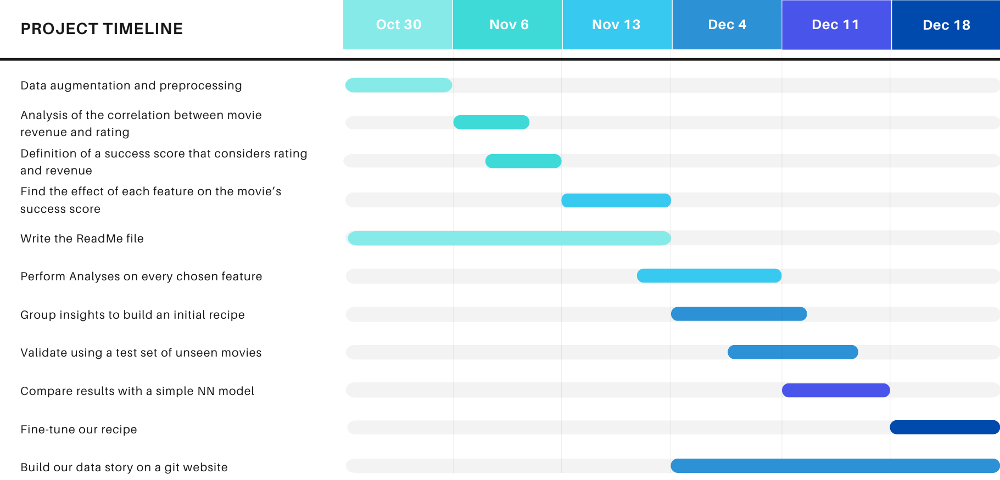

# The formula for a perfect movie

# INSET OUR DATA STORY HERE:

### Abstract:

The Formula for a Perfect Movie is a project that aims to uncover the complexity of cinematic success by examining
diverse features, including ratings, revenue, genre, inclusivity, and more. Motivated by the nuanced nature of film
achievement, we introduce a new Movie Score metric that considers ratings and revenue, providing a robust measure of a
movie's success. We aim to offer valuable insights into the secrets of successful filmmaking. By considering diverse and
valuable data sources, this project seeks to explore the value that can be extracted thanks to Data Science.

In our data story, we guide our readers through the investigative processes that were utilized on our journey to detect
the key influencers of good movies. As we unravel the insights embedded in the data, we hope that the reader will be
encouraged towards introspection, thinking about what they believe makes a successful movie.

# Research questions

In this project, we aim to tackle the following research questions:

* How can we define the success of a movie?
* Can we consider ratings and movie revenue to determine a success metric? Is there a correlation between ratings and
  movie revenue?
* Is there a formula that successful movies follow?
* Which features influence the success of a movie?
    * Considering: movie duration, language, geographical location of the setting, budget, genre, ethnic inclusivity,
      fame of actors, fame of producers, movie plot sentiment analysis, and movie sequels.

# Proposed additional datasets:

To answer our research questions, we will be using additional datasets:

* To study the effects of inclusivity on a movie’s success, we needed actors' information so we scraped
  the [Wikidata](https://query.wikidata.org/sparql)
  website. The dataset generated includes information about the actors’ ethnicity.
* Movie ratings are an important part of our project, yet we have no information about it in the given datasets.
  Therefore, we have a bot that looks for each movie on [IMDb](https://www.imdb.com) and extracts relevant information (
  e.g.
  ratings, number of ratings,
  revenue in the United States and Canada, global revenue, and revenue on the week of release) was used:
* To adjust box-office revenue for inflation, we fetched data from the [US Department of Labor Bureau
  Statistic](https://www.usinflationcalculator.com/inflation/consumer-price-index-and-annual-percent-changes-from-1913-to-2008/).
* To know which movies were sequels, we used a [dataset with movie-series](https://data.world/priyankad0993/sequels).

# Work Organization

For P2:
In order to realize this project, we collectively augmented and preprocessed the data. Then, when we noticed that there
was little correlation between movie ratings and revenue, we established a movie success score that considered both.
After that, each team member took a specialized aspect and examined if and how it shapes a film’s success or failure in
terms of the defined score. Aymeric delved into temporal factors and population dynamics, understanding their
correlation with financial success and viewer opinions. Yara studied genre analysis, as well as the effect of sequels.
Eric cleaned and explored inclusivity. Anthony analyzed features like duration and language, while Anton focused on the
influence of
actors’ fame. Finally, we brought our insights together and started building the recipe for a good movie.

For P3 please view Contributions at the end of the README
# Methods

To find the recipe for a good movie, we follow this methodology:

1) Data augmentation and processing

   One can’t start working with data before cleaning it and preparing it, which is why we carry the following steps:

    * Find datasets (e.g. Kaggle, scraping IMDB and Wikidata) containing additional data we need for our project and
      don’t have yet (e.g. movie ratings, inclusivity in movies, inflation, …).
    * Fill NaN values for inclusivity with data from more datasets (found online from scraping).
    * In the movies datasets, remove the movies without revenue and ratings data.
    * Adjust box office revenue to inflation to have comparable values.
    * In the actors datasets, remove lasting NaN values for inclusivity data.
    * Preprocess the data: convert data in each column into a more convenient format.
    * Analyze data balance and decide what to do if imbalanced, depending on the feature being analyzed.

3) Analysis of the correlation between movie revenue and rating
   Film directors define a good or bad movie according to its ratings and the revenue it generates. But are these two
   elements correlated? To answer this question, we conduct a Pearson correlation test and visualize the two
   distributions

4) Definition of a success score metric that considers both rating and revenue
   Since movie ratings and revenue are not significantly correlated, we define a movie success score metric (Movie
   Score), that considers them both:

    - $BORC$    : Box Office Revenue Component
    - $RC$      : Rating Component

   These components can be computed with the Adjusted Movie Revenue (we will write as $AMR$) and the movie rating (we
   will write as $MR$)

   We log-transform the data and define $x = \log(AMR)$ and $y = MR$

   $BORC = \frac{x - \min(x)}{\max(x) - \min(x)}$

   $RC = \frac{y - \min(y)}{\max(y) - \min(y)}$

   As such, we have $BORC, RC \in [0, 1]$

   We define a weight $\alpha \in [0, 1]$ and take the convex combinations of $BORC$ and $RC$. This weight controls the
   importance we give to each of our two components in our metric. Its importance will be determined in the future and
   we will adjust it accordingly to the study. Multiplying by 100 gives us a final score

   $$Movie Score = 100\left(\alpha BORC + (1 - \alpha) RC \right)$$

   Only then can we define two classes of good and bad movies by defining a percentage threshold on movie scores. We
   chose alpha = 0.5 to consider both components equally.

5) Find the effect of each feature on the movie’s success score.

  | Feature                               | Description                                                                                                    |
|---------------------------------------|----------------------------------------------------------------------------------------------------------------|
| Movie budget                          | Wonder if higher budgets are a gauge of qualitative movies.                                                    |
| Genres                                | Analyze the most successful genres.                                                                           |
| Ethnic & Gender diversity of the cast  | Get insight into the appeal of movies with a diverse cast.                                                     |
| Sequels                               | Analyze the popularity of sequels as opposed to prequels.                                                      |
| Actors' popularity                    | Define an actor's popularity as the mean of the 5 previous movies they acted in. Look at the correlation between the popularity of the cast and the movie score. |
| Movie producers' popularity           | Define the producer's popularity as the mean of the 5 previous movies they produced and study its correlation with the movie score.                              |
| Sentiment analysis of movie endings   | Get insight into the interest in movies with happy endings (and other types of endings).                      |
| Duration                              | Analyze the correlation between movie metadata and its success.                                                |
| Language                              | Look into the most successful movie languages.                                                                 |
| Country                               | Analyze whether certain movie settings are more appealing than others.                                        |

7) Find the importance of the grouped importance of features

The initial feature analysis gives insight on the importance of each feature individually. But this does not take into
account how the features can complement each other
in regards of predicting the movie score.

Our strategy is to process features further (scaling, feature creation ...) and feed them into regression models
that give insights
about the importance of our features by looking at the model's weights, such as linear regression. We want deep
insights, not just singular patterns that influence the movie scores.

7) Finally, a recipe for good movies …

From the above tests, we identify the features that affect the movie’s success the most thus defining a “recipe for good
movies”.

# Timeline
In light of the feedback that we got for P2, we chose to remove from our roadmap the validation with unseen data and the neural network.

# Contributions

<table class="tg">
    <thead>
      <tr>
        <th class="tg-0pky">Team member</th>
        <th class="tg-0pky">Contribution</th>
      </tr>
    </thead>
    <tr>
        <td>Anthony</td>
        <td>
            1) Created the script to scrape IMDb to get movie ratings and fill the missing data for revenue. 
            2) Anylyzed small features and their correlation with the movie score. 
            3) Collaborated in creation of the website.
        </td>
    </tr>
    <tr>
        <td>Anton</td>
        <td>
            1) Analyzed the correlation between the popularity of the cast and the movie score. 
            2) Analyzed the correlation between the popularity of the producers and the movie score. 
            3) Merged the notebooks.
        </td>
    </tr>
    <tr>
        <td>Aymeric</td>
        <td>
            1) Established the movie scoring system and analyzed the sequels and prequels. 
            2) Created and proofread the data story. 
            3) Collaborated in creation of the website.
        </td>
    </tr>
    <tr>
        <td>Eric</td>
        <td>
            1) Analyzed the inclusivity in movies. 
            2) Analyzed the sentiment analysis of movie endings. 
            3) Collaborated in creation of the website.
        </td>
    </tr>
    <tr>
        <td>Yara</td>
        <td>
            1) Analyzed the genres. 
            2) Created and proofread the data story. 
            2) Collaborated in creation of the website.
        </td>
</table>
